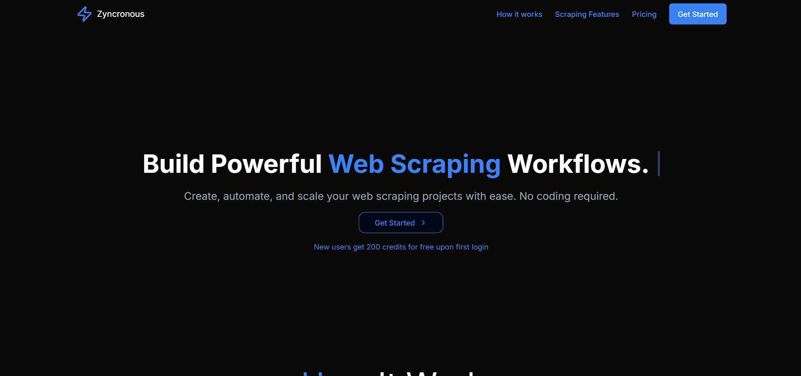
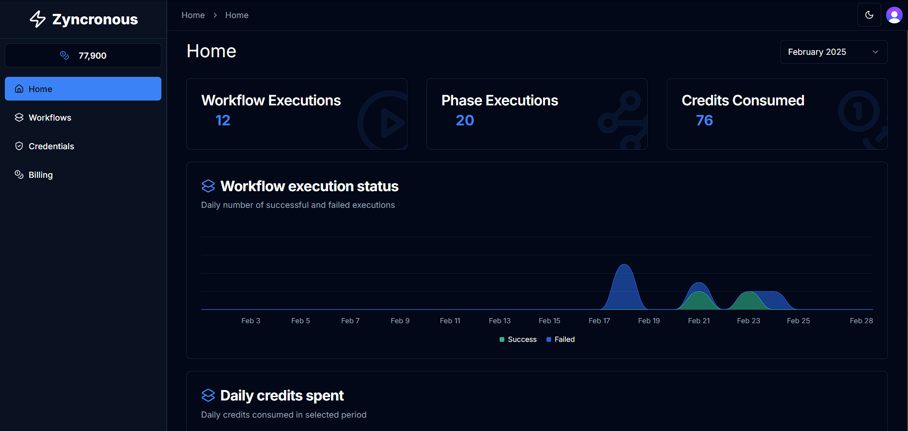
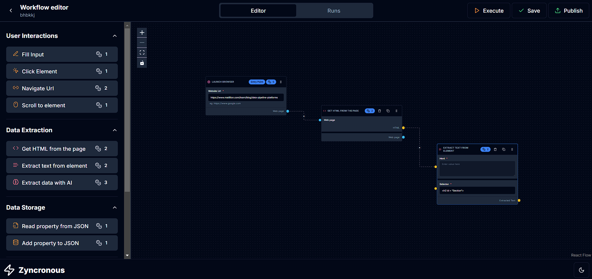

# Zyncronous





[](https://nextjs.org/)
[](https://www.typescriptlang.org/)
[](https://tailwindcss.com/)
[](https://reactjs.org/)
[](https://www.prisma.io/)
[](https://clerk.com/)
[](https://zod.dev/)
[](https://stripe.com)

A powerful SaaS platform that combines workflow management with automated web scraping to streamline data collection and processing.

## 🌟 Features

- 🔐 Secure Authentication with Clerk
- 🔄 Visual Workflow Builder
- 🕷️ Automated Web Scraping
- 📊 Data Processing & Analytics
- 🎨 Modern UI with Tailwind CSS
- 🌙 Dark/Light Mode Support
- ⚡ Real-time Updates
- 📱 Responsive Design

## 🚀 Tech Stack

- **Framework:** Next.js 14 with App Router
- **Language:** TypeScript
- **Styling:** Tailwind CSS
- **Authentication:** Clerk
- **Database:** Prisma with Neon
- **UI Components:** Radix UI
- **State Management:** React Query
- **Web Scraping:** Puppeteer
- **Charts:** Recharts
- **Workflow:** React Flow

## 📦 Installation

1. Clone the repository:
```bash
git clone https://github.com/DankJugal/Zyncronous_1.0.1
cd flowscrape-ai-webscraper
```

2. Install dependencies:
```bash
npm install
# or
yarn install
# or
bun install
```

3. Set up environment variables:
```bash
cp .env.example .env.local
```

4. Update the `.env.local` file with your credentials:
```env
NEXT_PUBLIC_APP_URL=
NEXT_PUBLIC_CLERK_PUBLISHABLE_KEY=
CLERK_SECRET_KEY=
NEXT_PUBLIC_CLERK_SIGN_IN_URL=
NEXT_PUBLIC_CLERK_SIGN_UP_URL=
NEXT_PUBLIC_CLERK_AFTER_SIGN_IN_URL=
NEXT_PUBLIC_CLERK_AFTER_SIGN_UP_URL=
DATABASE_URL=
```

5. Initialize the database:
```bash
npx prisma generate
npx prisma db push
```

6. Run the development server:
```bash
npm run dev
# or
yarn dev
# or
bun dev
```

Open [http://localhost:3000](http://localhost:3000) with your browser to see the result.

## 🛠️ Usage

1. Sign up for an account
2. Create a new workflow
3. Add scraping nodes to your workflow
4. Configure scraping parameters
5. Run and monitor your workflow
6. View and export collected data

## 📝 Environment Variables

| Variable | Description |
|----------|-------------|
| `NEXT_PUBLIC_APP_URL` | Your application URL |
| `NEXT_PUBLIC_CLERK_PUBLISHABLE_KEY` | Clerk public key |
| `CLERK_SECRET_KEY` | Clerk secret key |
| `DATABASE_URL` | Neon DB Link |

## Stripe Setup
Activate a Webhook on the YOUR_DEPLOYMENT_URL/api/webhook/ following link while testing on a deployed environment. Also you can choose proxy for web scraping a snippet of code is attached to do so, you can use BROWSERLESS for the following.

